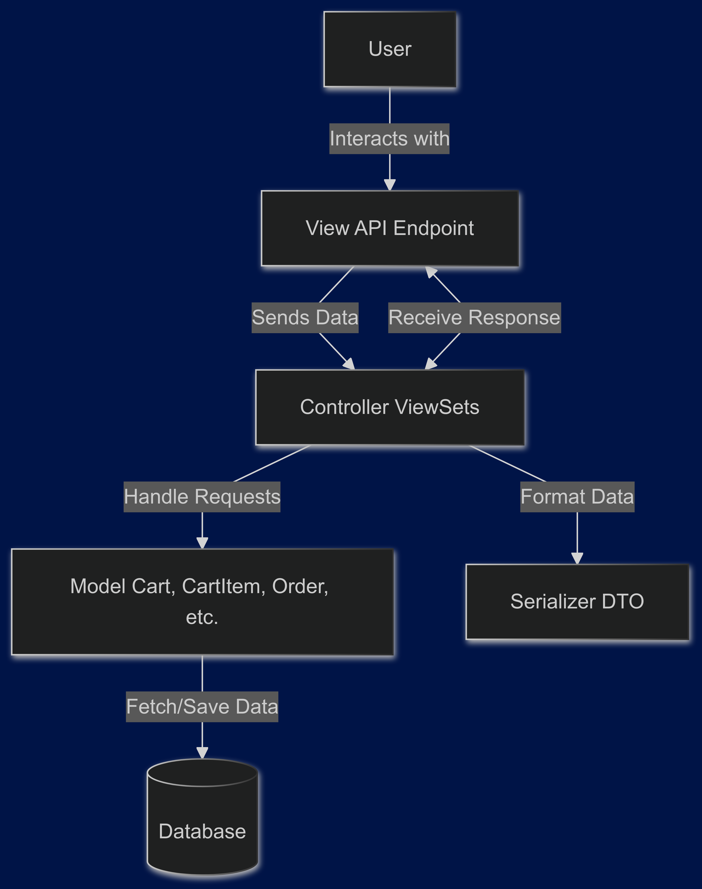

# E-commerce API

This is an e-commerce API built with Django, Django REST framework, and JWT for authentication.

## Features

- User registration and authentication
- Product listing and details
- Shopping cart management
- JWT-based authentication

## Architecture

This project follows a Monolithic Architecture, where all the components (user management, product management, cart, and order functionalities) are part of a single application. The monolithic approach simplifies deployment and maintenance.

## Design Pattern

The API is designed following the Model-View-Controller (MVC) pattern, where:
Models represent the data structure and handle the database operations.
Views contain the logic to handle HTTP requests and responses, including the use of Django REST Framework's ViewSets.
Controllers are implicit within Django's view handling, with ViewSets and Serializers acting as controllers to process data between models and views.
Additionally, Serializer classes in Django REST Framework adhere to the Data Transfer Object (DTO) pattern, ensuring data consistency and validation when exchanging information between the client and server.



## Technologies Used

- Django
- Django REST framework
- JWT (JSON Web Tokens)

## Installation

1. Clone the repository:
    ```bash
    git clone https://github.com/M4gic1540/e-commerceBackend
    cd e-commerceBackend
    ```

2. Create and activate a virtual environment:
    ```bash
    python -m venv venv
    source venv/bin/activate  # On Windows use `venv\Scripts\activate`
    ```

3. Install the dependencies:
    ```bash
    pip install -r requirements.txt
    ```

4. Apply migrations:
    ```bash
    python manage.py migrate
    ```

5. Create a superuser:
    ```bash
    python manage.py createsuperuser
    ```

6. Run the development server:
    ```bash
    python manage.py runserver
    ```

## API Endpoints

# USER Endpoints
- `GET /api/users/` -  List all users (you need authenticate for view users)
- `GET /api/users/<id>/` - List User Details (you need authenticate for view users)
- `POST /api/login/` - Login and obtain JWT token
- `POST /api/users/` - Register a new user
- `PUT /api/users/<id>/` - Modify details from user 
- `DELETE /api/users/<id>/` - Delete a User by ID

# PRODUCTS Endpoints
- `GET /api/products/` - List all products
- `GET /api/products/<id>/` - Retrieve product details
- `POST /api/products/` - Create New product
- `PUT /api/products/<id>/` - Modify product details
- `DELETE /api/products/<id>/` - Delete a product by ID

# CART Endpoints
- `GET /api/cart/` - List items to cart from authenticate user
- `DELETE /api/cart/<id>/` - Delete a cart from ID
- `GET /api/cart-items/` - View cart items from authenticate user
- `POST /api/cart-items/` - Add item to cart from authenticate user
- `POST /api/cart-items/` - Add item to cart from authenticate user

# ORDER Endpoints

- `POST /api/cart/checkout/` - proceed to checkout for authenticated users who have items in `cart-items`


## Authentication

This API uses JWT for authentication. To access protected endpoints, include the JWT token in the `Authorization` header:

```
Authorization: Bearer <your-token>
```

## License

This project is licensed under the MIT License.

